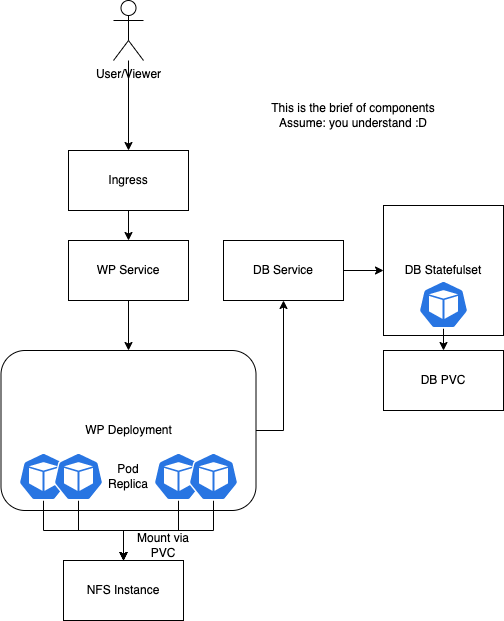

## Docker Wordpress

a new content creative company need to publish their contents to user.
you were asked to help the company to deploy wordpress as their publishing platform

### Task

- deploy wordpress on docker as the company looking for modern technology & portable stack
- please mind on how to scale the platform if the user/viewer of the content growing
- upload all your code into personal github/gitlab
- share with us the link to your repository

### Notes

- you can use docker/docker-compose/lxd/rkt as part of your container platform. we will adapt with your preferred stack
- if you encounter any problem during the process. please confirm to our Recruiter. or you can put the notes this text input also
- please create and instruction named README.md in the repository. and please list step by step required to run your answer
- you may googling to find reference/documentation about python/bash/docker. we will not count it as cheating

---

### Assume

- db stack mysql single instance (container)
- use existing image (no need to build the image)
- plain text (http)

# Deploy Wordpress using docker-compose

```bash
cd docker-compose/
docker-compose up -d

Creating network "wp_default" with the default driver
Creating wp_db_1 ... done
Creating wp_wp_1 ... done

```

## Check the container status

```bash
docker-compose ps

 Name                Command               State          Ports        
-----------------------------------------------------------------------
wp_db_1   docker-entrypoint.sh --def ...   Up      3306/tcp, 33060/tcp 
wp_wp_1   docker-entrypoint.sh apach ...   Up      0.0.0.0:8080->80/tcp

```

# Deploy Wordpress in kubernetes to enable HA
Scale the platform if the user/viewer of the content growing is not possible in docker-compose. The docker-compose can only running in 1 instance/VM. We need to deploy wordpress in kubernetes to achive high-availability.

## Component
- Statefulset (DB)
- Deployment (WP)
- Service (WP & DB)
- NFS instance to store shared wp content


## Architecture



## Assume
- We already setup NFS to enable *ReadWriteMany* volume
